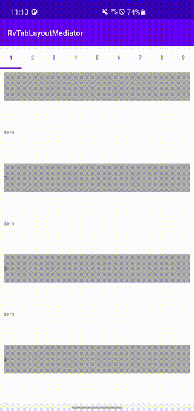

# RvTabLayoutMediator

[](https://opensource.org/licenses/Apache-2.0)


RvTabLayoutMediator is a mediator to link a TabLayout with a RecyclerView.



## Usage

### dependency

```build.gradle
dependencies {
    implementation 'com.github.sasakitomohiro:rvtablayoutmediator:latest'
}
```

### example
```xml
<?xml version="1.0" encoding="utf-8"?>
<layout xmlns:android="http://schemas.android.com/apk/res/android"
    xmlns:app="http://schemas.android.com/apk/res-auto"
    xmlns:tools="http://schemas.android.com/tools">

    <androidx.constraintlayout.widget.ConstraintLayout
        android:layout_width="match_parent"
        android:layout_height="match_parent"
        tools:context=".MainActivity">

        <com.google.android.material.tabs.TabLayout
            android:id="@+id/tab"
            android:layout_width="0dp"
            android:layout_height="wrap_content"
            app:layout_constraintEnd_toEndOf="parent"
            app:layout_constraintStart_toStartOf="parent"
            app:layout_constraintTop_toTopOf="parent" />

        <androidx.recyclerview.widget.RecyclerView
            android:id="@+id/recycler"
            android:layout_width="0dp"
            android:layout_height="0dp"
            app:layout_constraintBottom_toBottomOf="parent"
            app:layout_constraintEnd_toEndOf="parent"
            app:layout_constraintStart_toStartOf="parent"
            app:layout_constraintTop_toBottomOf="@id/tab" />
    </androidx.constraintlayout.widget.ConstraintLayout>
</layout>

```

```kt
binding.recycler.layoutManager = LinearLayoutManager(this)
binding.recycler.adapter = sampleAdapter
sampleAdapter.update(items)

RvTabLayoutMediator(
    binding.tab,
    binding.recycler,
    sampleAdapter,
    object : RvTabConfigurationStrategy {
        override fun onConfigureTab(tab: TabLayout.Tab, position: Int) {
            tab.text = items[position].toString()
        }
    }
).attach()
```
